# Evo AI - API Flows

This document describes common API flows and usage patterns for the Evo AI platform.

## Authentication Flow

### User Registration and Verification

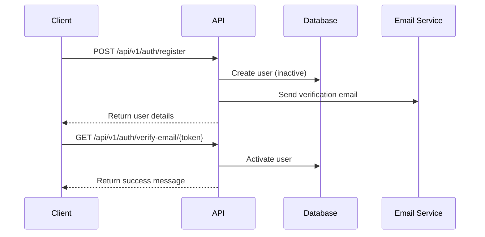

### Login Flow

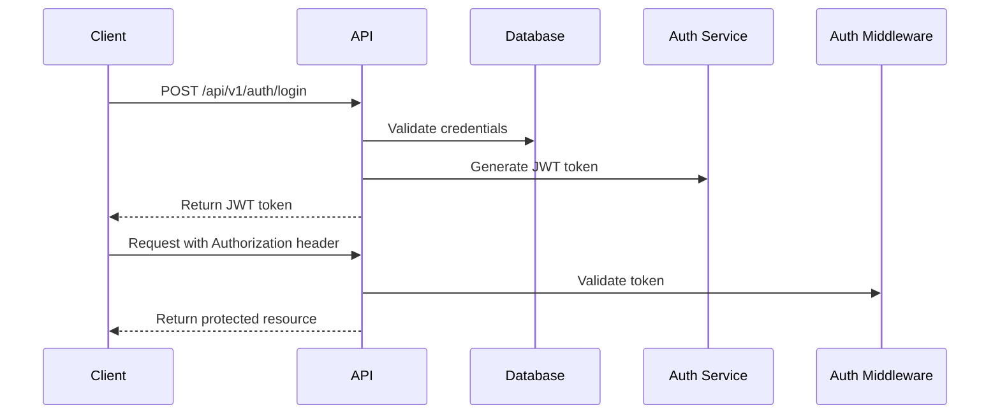

### Password Recovery

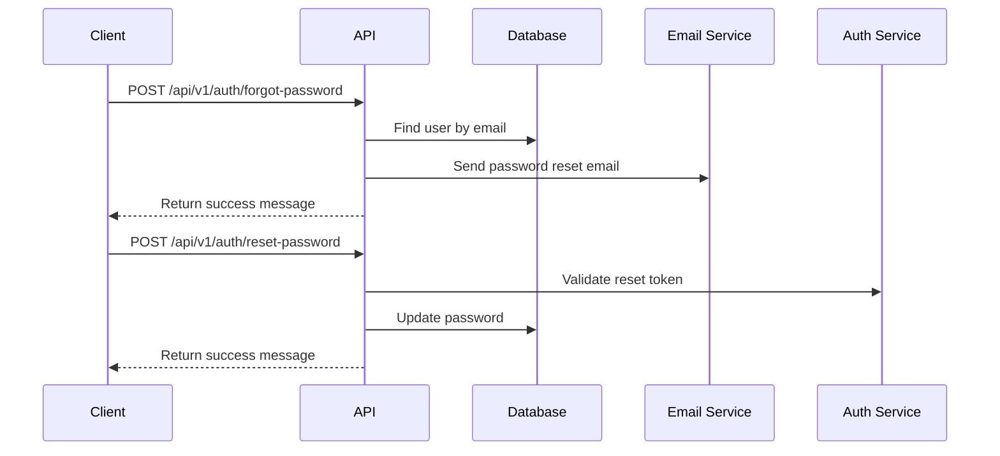

## Agent Management

### Creating and Using an Agent

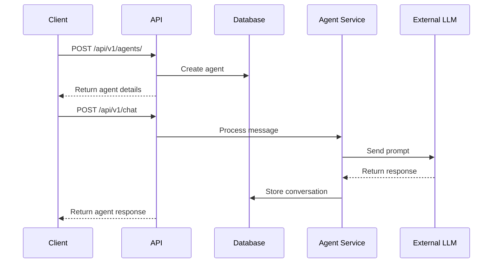

### Sequential Agent Flow

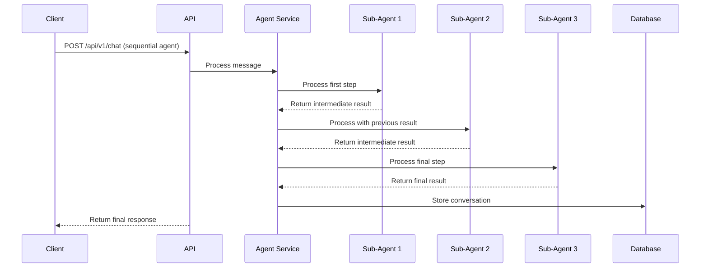

## Client and Contact Management

### Client Creation and Management

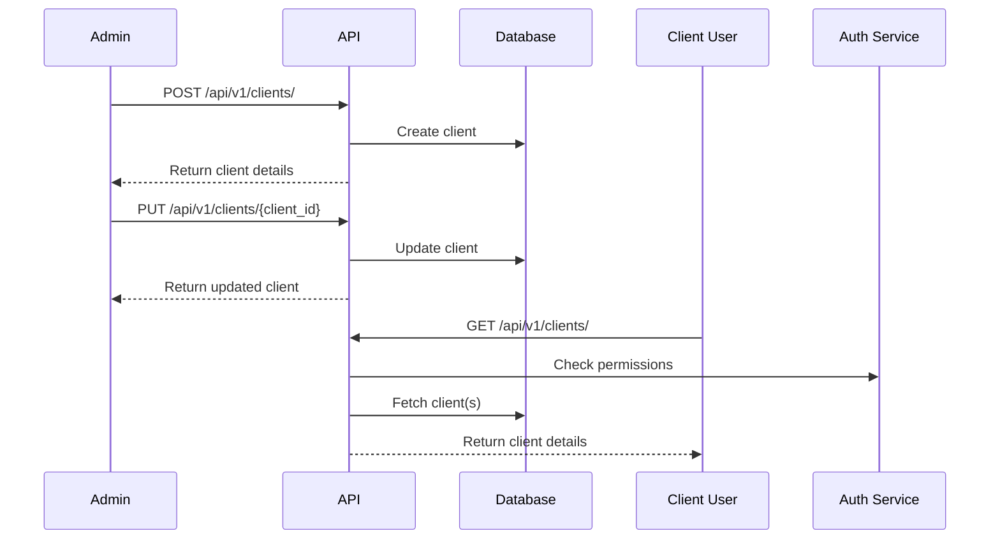

### Contact Management

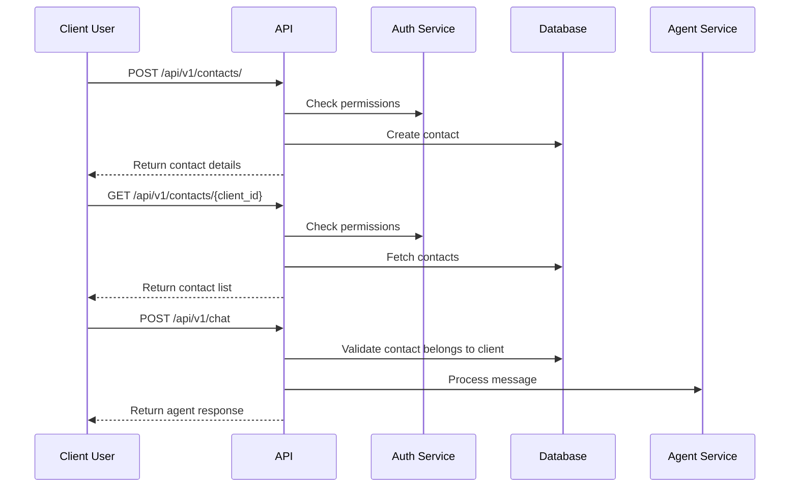

## MCP Server and Tool Management

### MCP Server Configuration

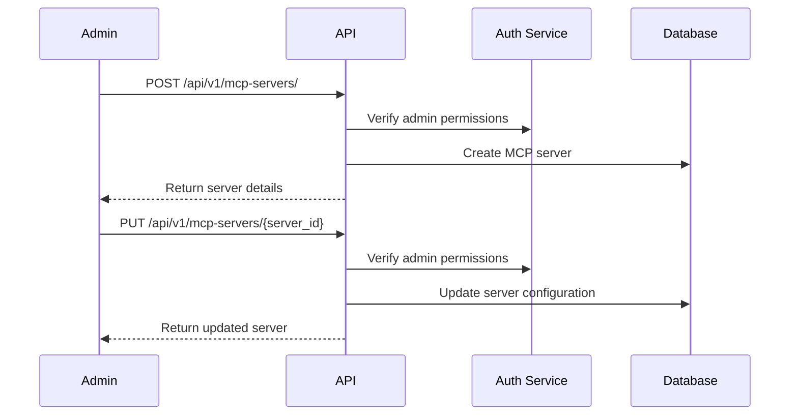

### Tool Configuration and Usage

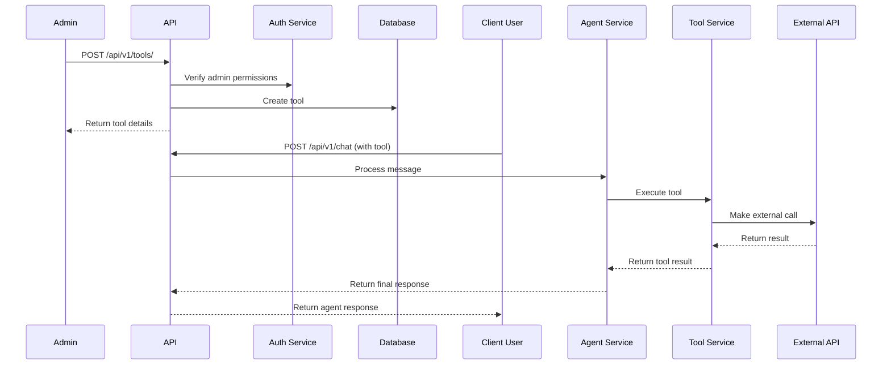

## Audit and Monitoring

### Audit Log Flow

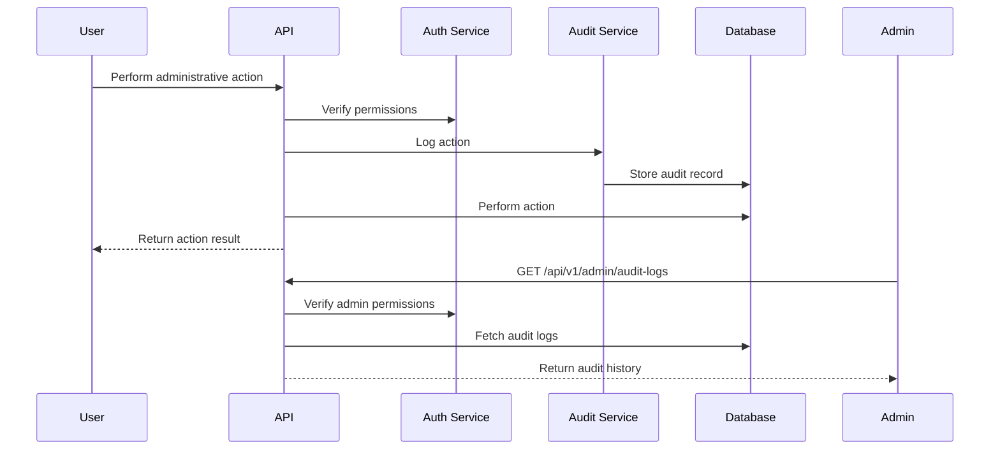

## Error Handling

### Common Error Flows

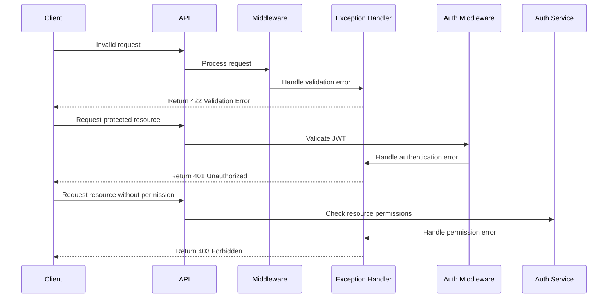

## API Integration Best Practices

1. **Authentication**:
   - Store JWT tokens securely
   - Implement token refresh mechanism
   - Handle token expiration gracefully

2. **Error Handling**:
   - Implement proper error handling for all API calls
   - Pay attention to HTTP status codes
   - Log detailed error information for debugging

3. **Resource Management**:
   - Use pagination for listing resources
   - Filter only the data you need
   - Consider implementing client-side caching for frequently accessed data

4. **Agent Configuration**:
   - Start with preset agent templates
   - Test agent configurations with sample data
   - Monitor and adjust agent parameters based on performance

5. **Security**:
   - Never expose API keys or tokens in client-side code
   - Validate all user input before sending to the API
   - Implement proper permission checks in your application 